<p align="center">
  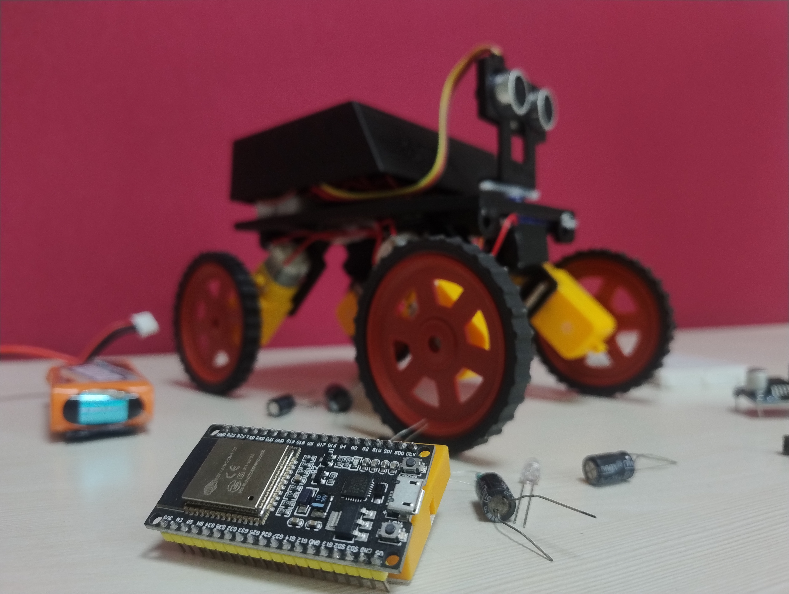
 </p>
 
 <h1 align="center" style="font-size: 2.5em; color: #2c3e50; margin-top: 20px;">
 🚗 STEMed Mobile Application & ESP32 Car Project
 </h1>
 
 <p align="center" style="font-size: 1.2em; color: #7f8c8d;">
 A versatile mobile application designed to control robotics and IoT devices over Bluetooth Low Energy (BLE), with a fully functional ESP32-based robotic car example.
 </p>
 
 <p align="center">
  <a href="https://youtube.com/shorts/ep0MHZMkmzY?feature=share" target="_blank">
  
  </a>
 </p>
 
<p align="center">
  <a href="https://github.com/vishnu-iitp/STEM-ed_app/releases/download/STEM-ed/Stem-ed.apk" target="_blank" style="display: inline-block; background-color: #007BFF; color: #ffffff; padding: 12px 24px; font-size: 16px; font-weight: bold; text-align: center; text-decoration: none; border-radius: 8px; box-shadow: 0 4px 6px rgba(0, 0, 0, 0.1);">
    ⬇️ Download The App
  </a>
</p>
 
 <hr style="border: 1px solid #d3d3d3; margin: 20px 0;">

---

## 🛠️ 4WD Car Chassis Assembly Manual

> **Now Available on Flipkart!** 🛒  
> Get your hands on our premium **4WD Car Chassis Kit** - a screwless design that's perfect for robotics enthusiasts, students, and hobbyists!

### 📦 **What's Included in the Kit**

- ✅ **4x Motor Mounts** - Secure housing for your DC motors
- ✅ **1x Main Chassis** - Robust base platform for mounting all components
- ✅ **1x Servo Motor Mount** - Precision mount for servo attachment
- ✅ **1x SR04 Sensor Mount** - Dedicated holder for ultrasonic sensor

> **⚠️ Note:** Motors and sensors are **not included** in the kit. This chassis is designed to work with standard 100 RPM BO DC motors and HC-SR04 ultrasonic sensors.

---

### 🔧 **Assembly Instructions**

This is a **screwless chassis** design that uses strings/zip ties to securely hold components in place, making assembly and modifications quick and easy!

---

#### **Step 1: Attach Motors to Motor Mounts** 🔩

Secure your **100 RPM BO DC motors** (not included) to each of the four motor mounts using strings or zip ties. Make sure the motors are firmly attached and aligned properly.

<div align="center">
  
  
  
  
</div>

<p align="center"><em>📸 Securing the DC motor to the motor mount</em></p>

---

#### **Step 2: Attach Motor Mounts to Main Chassis** 🚗

Connect all four motor mounts (with motors attached) to the main chassis body. Position them at the four corners and secure them using strings or zip ties through the designated slots.

<div align="center">
  
</div>

<p align="center"><em>📸 All four motor mounts attached to the main chassis</em></p>

---

#### **Step 3: Install Servo Motor and SR04 Sensor Mount** 📡

1. **Attach the servo motor** to the main chassis body at the designated mounting point using strings or zip ties
2. **Connect the servo mount** to the servo motor horn
3. **Attach the SR04 sensor mount** to the SR04 ultrasonic sensor
4. **Mount the sensor** onto the servo mount for 360° obstacle detection capability

<div align="center">
  
  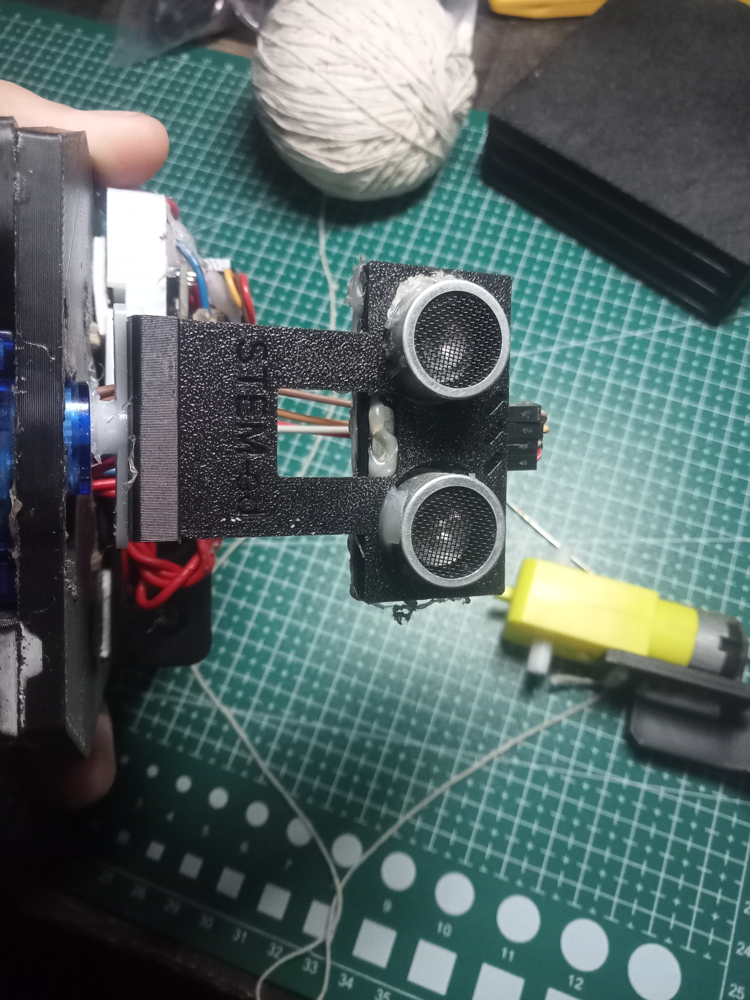
  
  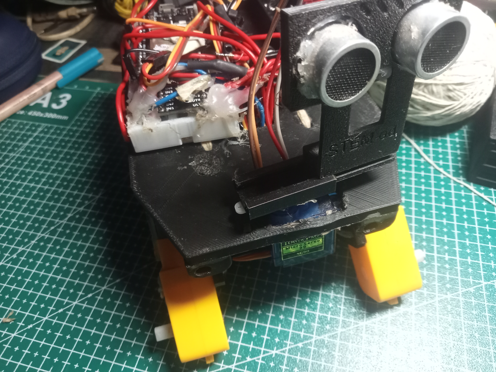
  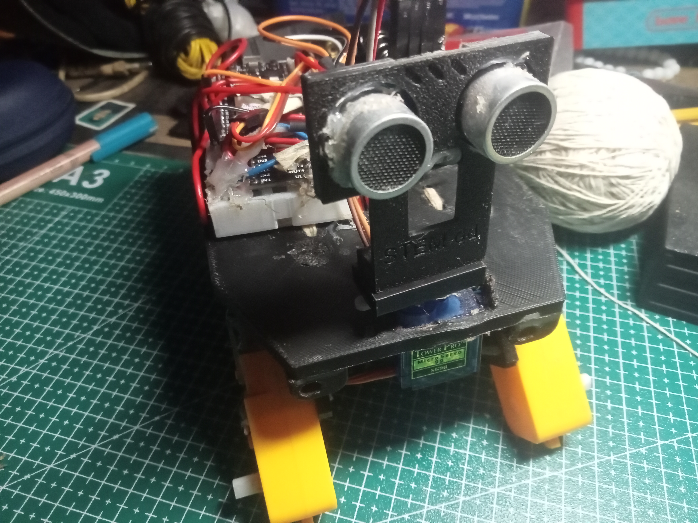
</div>

<p align="center"><em>📸 Installing servo motor and SR04 sensor mount for obstacle avoidance</em></p>

---

### ✨ **Key Features**

- 🔧 **Screwless Design** - Easy assembly and modification using strings/zip ties
- 🎯 **Servo-Based Sensor Mount** - Enable dynamic obstacle detection and avoidance
- 💪 **Robust Construction** - Durable chassis suitable for various robotics projects
- 🔄 **Versatile Platform** - Compatible with ESP32, Arduino, and other microcontrollers

---

### 🎓 **Perfect For:**

- 🤖 Robotics projects and competitions
- 📚 STEM education and learning
- 🔬 DIY electronics enthusiasts
- 🏆 School and college projects

---

<hr style="border: 1px solid #d3d3d3; margin: 20px 0;">
 
 ## 1. Introduction
 
 👋 Welcome to **STEMed**, a mobile app that interfaces with and controls various hardware projects, with a primary focus on **robotics** and **IoT devices**.
 It connects to hardware via **Bluetooth Low Energy (BLE)** and provides multiple control interfaces to suit your project's needs.
 
 This documentation covers:
 
 - 📱 App features and screens 
 - 📡 BLE communication protocol 
 - 🤖 Complete Arduino code for building your own **ESP32-based robotic car**
 
 <hr style="border: 1px solid #d3d3d3; margin: 20px 0;">


## 📸 APP UI

<div style="display: flex; flex-direction: column; align-items: center; gap: 20px;">

  <!-- Landscape Screenshot -->
  <div style="text-align: center;">
    <h3>🌐 Main App Overview</h3>
    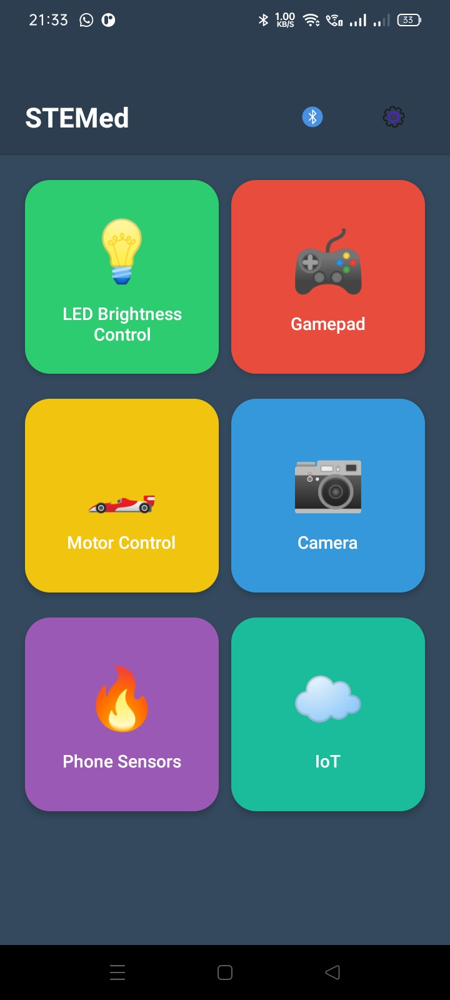
  </div>

  <!-- Portrait Screenshots in Row -->
  <div style="display: flex; justify-content: center; gap: 20px; flex-wrap: wrap;">
    <div style="text-align: center;">
      <h3>📄 Gamepad Mode </h3>
      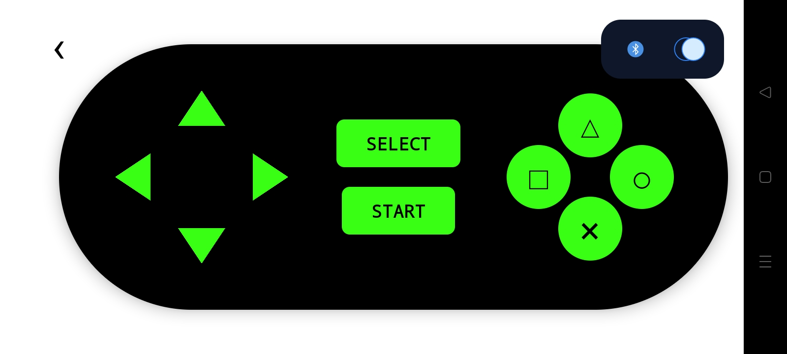
    </div>
    <div style="text-align: center;">
      <h3>📄 Aceelerometer mode </h3>
      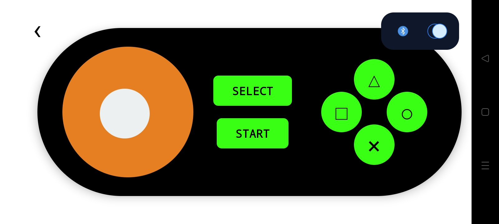
    </div>
  </div>

</div>

---
 
 ## 2. Core Features
 
 ✨ **Bluetooth LE Connectivity**: Scan, connect, and disconnect from BLE devices effortlessly. 
 🎮 **Multiple Control Interfaces**:
  - **🕹️ Gamepad Mode**: Classic directional and action commands for intuitive control. 
  - **📱 Accelerometer Mode**: Tilt-based analog control for a dynamic experience. 
 📊 **Real-time Sensor Data**: Visualize accelerometer, gyroscope, and magnetometer readings in real-time. 
 💡 **User-Friendly Interface**: Clean, intuitive navigation for a seamless user experience. 
 
 <hr style="border: 1px solid #d3d3d3; margin: 20px 0;">
 
 ## 3. Screen-by-Screen Breakdown
 
 ### 3.1 Home Screen
 - **Header**: Displays the app name, a Bluetooth Device Scanner button 📡, and a Settings button ⚙️. 
 - **Module Grid**: Provides quick access to:
  - **🎮 Gamepad**: Opens the combined Gamepad/Accelerometer control screen. 
  - **📱 Phone Sensors**: Navigates to the real-time sensor data display. 
  - *(🚀 Other modules like LED Control, Motor Control, Camera, IoT are planned for future updates!)*
 
 ### 3.2 Bluetooth Connection Modal
 - **Scanning**: Automatically scans for nearby BLE devices for 10 seconds. ⏱️
 - **Device List**: Presents a clear list of all discovered devices. 
 - **Actions**: Offers options to Rescan 🔄, Disconnect 🚫, and Close ❌ the modal. 
 
 ### 3.3 Gamepad Control Screen
 Features two distinct control modes: 
 
 1. **🕹️ Gamepad Mode** (default) 
  - **D-Pad Commands**:
  - `U_PRESSED` / `U_RELEASED` (⬆️)
  - `D_PRESSED` / `D_RELEASED` (⬇️)
  - `L_PRESSED` / `L_RELEASED` (⬅️)
  - `R_PRESSED` / `R_RELEASED` (➡️)
  - **Action Buttons**:
  - △ → `T` 
  - □ → `S` 
  - ○ → `O` 
  - × → `X` 
  - `SELECT`
  - `START`
 
 2. **📱 Accelerometer Mode** - Transmits `xPWM,yPWM` values based on the device's tilt. 
  - Value Ranges: `-255` to `255`. 
  - Includes a visual feedback joystick to represent the tilt. 
  - Retains full functionality of the Action buttons from Gamepad Mode. 
 
 <hr style="border: 1px solid #d3d3d3; margin: 20px 0;">
 
 ## 4. BLE Communication Protocol
 
 For seamless compatibility with STEMed, your device's BLE implementation must adhere to the following:
 
 - **Service UUID**: `4fafc201-1fb5-459e-8fcc-c5c9c331914b` 🆔
 - **Characteristic UUID**: `beb5483e-36e1-4688-b7f5-ea07361b26a8` 🔑
 - It must be configured to accept string commands as defined in the Gamepad and Accelerometer control sections. 
 
 <hr style="border: 1px solid #d3d3d3; margin: 20px 0;">
 
 ## 5. STEM-ed Car Kit Components
 
 📦 Below is a comprehensive list of all the components included in your STEM-ed Car Kit. 
 All these parts are conveniently located in the `assets` folder on GitHub. 
 
 | Image | Component | Quantity |
 |-------|-----------|----------|
 | <p align="center">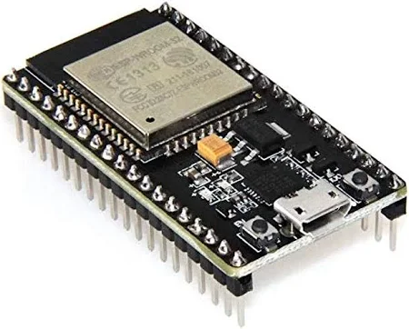</p> | ESP32 Development Board | 1 |
 | <p align="center">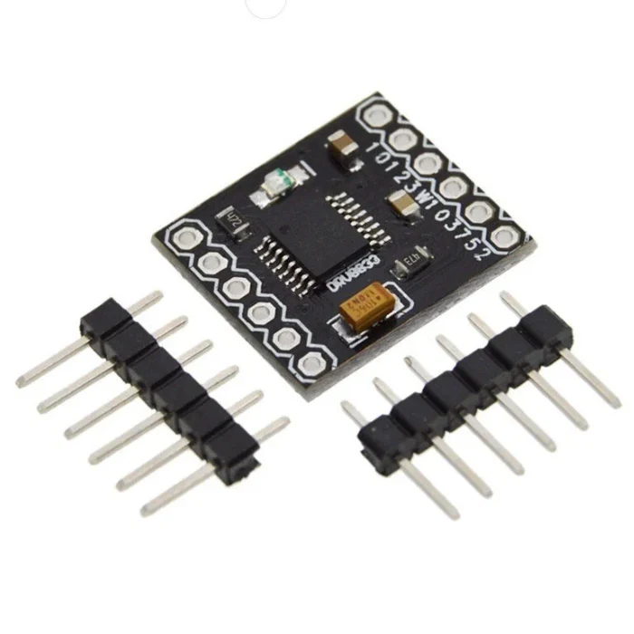</p> | DRV8833 Motor Driver | 1 |
 | <p align="center">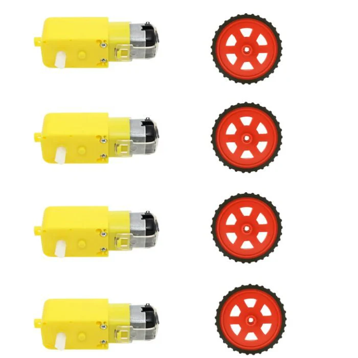</p> | DC Motors | 4 |
 | <p align="center"></p> | Wheels | 4 |
 | <p align="center">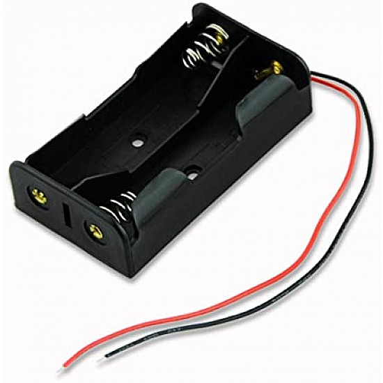</p> | 18650 Battery Holder | 1 |
 | <p align="center">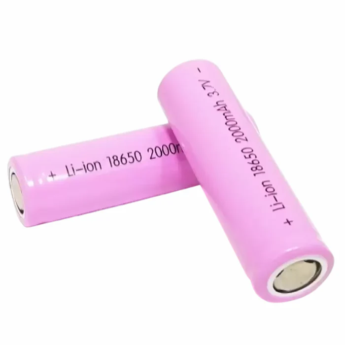</p> | 18650 Batteries | 2 |
 | <p align="center">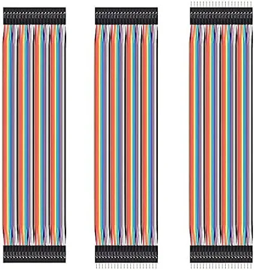</p> | Jumper Wires | 10 |
 | <p align="center">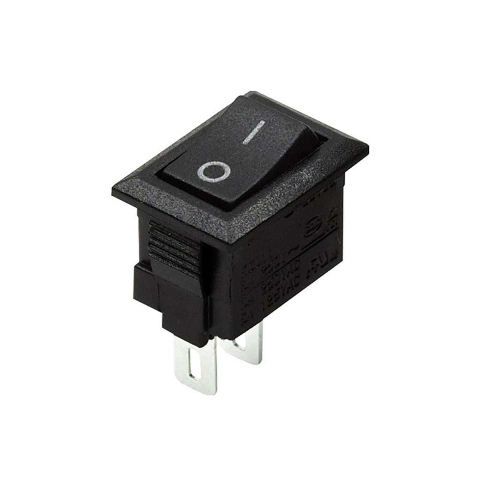</p> | On/Off Switch | 1 |
 | <p align="center">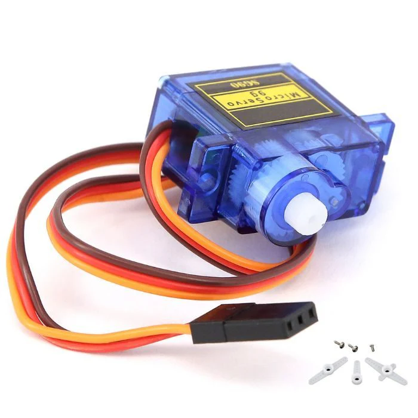</p> | Servo Motor | 1 |
 | <p align="center">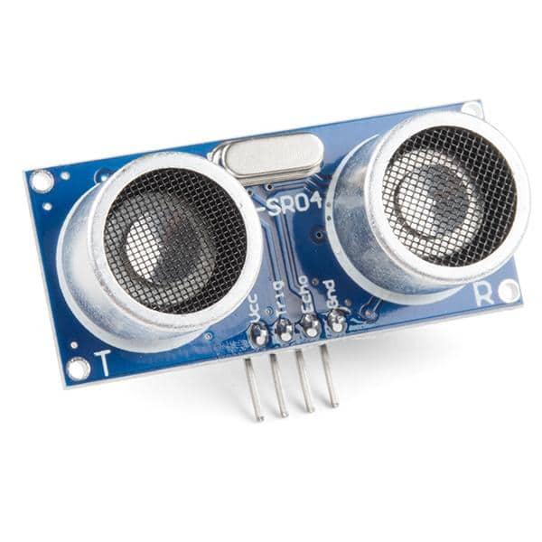</p> | SR04 Sensor | 1 |
 | <p align="center">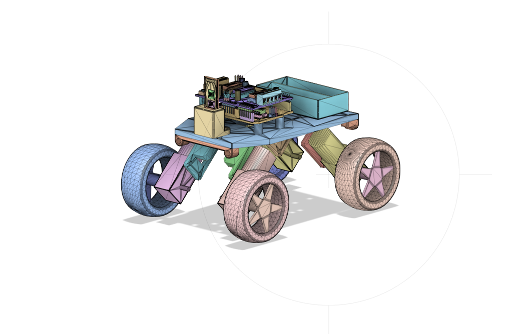</p> | 3D Printed Chassis | 1 |
 
 <hr style="border: 1px solid #d3d3d3; margin: 20px 0;">
 
 ## 7. Wiring Instructions 
 
 🔌 Below are the detailed wiring instructions to connect the components. 
 
 | Component | Pin Name (ESP32) | GPIO Pin |
 |-----------------------|------------------|----------|
 | Right Motor(+ve) - IN1(drv8833) | `rightMotorPin1` | 14 |
 | Right Motor(-ve) - IN2(drv8833) | `rightMotorPin2` | 27 |
 | Left Motor(+ve) - IN1(drv8833) | `leftMotorPin1` | 26 |
 | Left Motor(-ve) - IN2(drv8833) | `leftMotorPin2` | 25 |
 | Ultrasonic Sensor - TRIG | `trigPin` | 5 |
 | Ultrasonic Sensor - ECHO | `echoPin` | 18 |
 | Servo Motor Signal | `servoPin` | 17 |
 
 <hr style="border: 1px solid #d3d3d3; margin: 20px 0;">
 
 ## 8. ESP32 Car Example
 
 💻 Below is a **fully functional Arduino sketch** for an ESP32 robotic car designed to be completely compatible with STEMed. 
 
 ```cpp
 
 
 #include <Arduino.h>
 #include <BLEDevice.h>
 #include <BLEUtils.h>
 #include <BLEServer.h>
 #include <ESP32Servo.h>
 #include <driver/ledc.h>
 
 #define SERVICE_UUID         "4fafc201-1fb5-459e-8fcc-c5c9c331914b"
 #define CHARACTERISTIC_UUID "beb5483e-36e1-4688-b7f5-ea07361b26a8"
 
 BLEServer *pServer = NULL;
 
 int rightMotorPin1 = 14, rightMotorPin2 = 27;
 int leftMotorPin1  = 26, leftMotorPin2  = 25;
 const int trigPin = 5;
 const int echoPin = 18;
 const int servoPin = 17;
 Servo servo;
 
 #define MAX_MOTOR_SPEED 255
 const int PWMFreq = 1000;
 const ledc_timer_bit_t PWMResolution = LEDC_TIMER_8_BIT;
 
 #define LEDC_TIMER            LEDC_TIMER_0
 #define LEDC_SPEED_MODE       LEDC_LOW_SPEED_MODE
 #define LEDC_CHANNEL_R1       LEDC_CHANNEL_0
 #define LEDC_CHANNEL_R2       LEDC_CHANNEL_1
 #define LEDC_CHANNEL_L1       LEDC_CHANNEL_2
 #define LEDC_CHANNEL_L2       LEDC_CHANNEL_3
 
 bool up_pressed = false, down_pressed = false, left_pressed = false, right_pressed = false;
 int currentSpeed = 0, currentTurn = 0;
 const int SPEED_DEAD_ZONE = 120, TURN_DEAD_ZONE = 120;
 bool obstacleMode = false;
 const int OBSTACLE_THRESHOLD = 25;
 const unsigned long TURN_DURATION = 600;
 volatile bool isConnected = false;
 
 void processCommand(String cmd);
 void rotateMotor(int rightSpeed, int leftSpeed);
 void runAccelerometerControl();
 
 class MyCharacteristicCallbacks: public BLECharacteristicCallbacks {
  void onWrite(BLECharacteristic *pCharacteristic) {
   String value = pCharacteristic->getValue();
   if (value.length() > 0) {
    value.trim();
    processCommand(value);
   }
  }
 };
 
 class MyServerCallbacks: public BLEServerCallbacks {
  void onConnect(BLEServer* pServer) { isConnected = true; }
  void onDisconnect(BLEServer* pServer) {
   isConnected = false;
   up_pressed = down_pressed = left_pressed = right_pressed = false;
   currentSpeed = currentTurn = 0;
   rotateMotor(0, 0);
   BLEDevice::startAdvertising();
  }
 };
 
 void setUpHardware() {
  pinMode(trigPin, OUTPUT);
  pinMode(echoPin, INPUT);
 
  ledc_timer_config_t ledc_timer = {
   .speed_mode   = LEDC_SPEED_MODE,
   .duty_resolution = PWMResolution,
   .timer_num   = LEDC_TIMER,
   .freq_hz    = PWMFreq,
   .clk_cfg   = LEDC_AUTO_CLK
  };
  ESP_ERROR_CHECK(ledc_timer_config(&ledc_timer));
 
  ledc_channel_config_t r1_conf = { .gpio_num=rightMotorPin1, .speed_mode=LEDC_SPEED_MODE, .channel=LEDC_CHANNEL_R1, .timer_sel=LEDC_TIMER, .duty=0 };
  ledc_channel_config(&r1_conf);
  ledc_channel_config_t r2_conf = { .gpio_num=rightMotorPin2, .speed_mode=LEDC_SPEED_MODE, .channel=LEDC_CHANNEL_R2, .timer_sel=LEDC_TIMER, .duty=0 };
  ledc_channel_config(&r2_conf);
  ledc_channel_config_t l1_conf = { .gpio_num=leftMotorPin1, .speed_mode=LEDC_SPEED_MODE, .channel=LEDC_CHANNEL_L1, .timer_sel=LEDC_TIMER, .duty=0 };
  ledc_channel_config(&l1_conf);
  ledc_channel_config_t l2_conf = { .gpio_num=leftMotorPin2, .speed_mode=LEDC_SPEED_MODE, .channel=LEDC_CHANNEL_L2, .timer_sel=LEDC_TIMER, .duty=0 };
  ledc_channel_config(&l2_conf);
 
  servo.attach(servoPin, 500, 2500);
  servo.setPeriodHertz(50);
  servo.write(90);
  rotateMotor(0, 0);
 }
 
 void setDuty(ledc_channel_t channel, uint32_t duty) {
  ledc_set_duty(LEDC_SPEED_MODE, channel, duty);
  ledc_update_duty(LEDC_SPEED_MODE, channel);
 }
 
 void rotateMotor(int rightSpeed, int leftSpeed) {
  rightSpeed = constrain(rightSpeed, -MAX_MOTOR_SPEED, MAX_MOTOR_SPEED);
  leftSpeed = constrain(leftSpeed, -MAX_MOTOR_SPEED, MAX_MOTOR_SPEED);
 
  if (rightSpeed > 0) { setDuty(LEDC_CHANNEL_R1, rightSpeed); setDuty(LEDC_CHANNEL_R2, 0); }
  else if (rightSpeed < 0) { setDuty(LEDC_CHANNEL_R1, 0); setDuty(LEDC_CHANNEL_R2, abs(rightSpeed)); }
  else { setDuty(LEDC_CHANNEL_R1, 0); setDuty(LEDC_CHANNEL_R2, 0); }
 
  if (leftSpeed > 0) { setDuty(LEDC_CHANNEL_L1, leftSpeed); setDuty(LEDC_CHANNEL_L2, 0); }
  else if (leftSpeed < 0) { setDuty(LEDC_CHANNEL_L1, 0); setDuty(LEDC_CHANNEL_L2, abs(leftSpeed)); }
  else { setDuty(LEDC_CHANNEL_L1, 0); setDuty(LEDC_CHANNEL_L2, 0); }
 }
 
 void handleAccelerometerControl(int xPwm, int yPwm) {
  if (obstacleMode) return;
  currentSpeed = (abs(yPwm) > SPEED_DEAD_ZONE) ? yPwm : 0;
  currentTurn  = (abs(xPwm) > TURN_DEAD_ZONE) ? xPwm : 0;
 }
 
 void processCommand(String cmd) {
  if (cmd.indexOf(',') != -1) {
   int commaIndex = cmd.indexOf(',');
   handleAccelerometerControl(cmd.substring(0, commaIndex).toInt(), cmd.substring(commaIndex + 1).toInt());
  } else {
   if (cmd == "U_PRESSED") up_pressed = true;
   else if (cmd == "U_RELEASED") up_pressed = false;
   else if (cmd == "D_PRESSED") down_pressed = true;
   else if (cmd == "D_RELEASED") down_pressed = false;
   else if (cmd == "L_PRESSED") left_pressed = true;
   else if (cmd == "L_RELEASED") left_pressed = false;
   else if (cmd == "R_PRESSED") right_pressed = true;
   else if (cmd == "R_RELEASED") right_pressed = false;
   else if (cmd == "START") { obstacleMode = true; up_pressed = down_pressed = left_pressed = right_pressed = false; currentSpeed = currentTurn = 0; rotateMotor(0,0); }
   else if (cmd == "SELECT") { obstacleMode = false; rotateMotor(0,0); }
  }
 }
 
 void runManualControl() {
  int rightSpeed = 0, leftSpeed = 0;
  if (up_pressed) { rightSpeed = MAX_MOTOR_SPEED; leftSpeed = MAX_MOTOR_SPEED; }
  else if (down_pressed) { rightSpeed = -MAX_MOTOR_SPEED; leftSpeed = -MAX_MOTOR_SPEED; }
  else if (left_pressed) { rightSpeed = MAX_MOTOR_SPEED; leftSpeed = -MAX_MOTOR_SPEED; }
  else if (right_pressed) { rightSpeed = -MAX_MOTOR_SPEED; leftSpeed = MAX_MOTOR_SPEED; }
  rotateMotor(rightSpeed, leftSpeed);
 }
 
 void runAccelerometerControl() {
  float rawLeft = currentSpeed - currentTurn;
  float rawRight = currentSpeed + currentTurn;
  float maxMagnitude = max(abs(rawLeft), abs(rawRight));
  float scale = (maxMagnitude > MAX_MOTOR_SPEED) ? (MAX_MOTOR_SPEED / maxMagnitude) : 1.0;
  rotateMotor((int)(rawRight * scale), (int)(rawLeft * scale));
 }
 
 long measureDistanceCM() {
  digitalWrite(trigPin, LOW); delayMicroseconds(2);
  digitalWrite(trigPin, HIGH); delayMicroseconds(10);
  digitalWrite(trigPin, LOW);
  long duration = pulseIn(echoPin, HIGH, 30000);
  return (duration == 0) ? 999 : duration * 0.034 / 2;
 }
 
 void runObstacleAvoidance() {
  long distance = measureDistanceCM();
  if (distance > OBSTACLE_THRESHOLD) {
   servo.write(90);
   rotateMotor(MAX_MOTOR_SPEED / 2, MAX_MOTOR_SPEED / 2);
  } else {
   rotateMotor(0, 0); delay(100);
   rotateMotor(-MAX_MOTOR_SPEED / 2, -MAX_MOTOR_SPEED / 2); delay(400);
   rotateMotor(0, 0); delay(100);
   servo.write(30); delay(300); long distLeft = measureDistanceCM();
   servo.write(150); delay(300); long distRight = measureDistanceCM();
   servo.write(90); delay(300);
   if (distLeft > distRight && distLeft > OBSTACLE_THRESHOLD) rotateMotor(-MAX_MOTOR_SPEED, MAX_MOTOR_SPEED);
   else if (distRight > distLeft && distRight > OBSTACLE_THRESHOLD) rotateMotor(MAX_MOTOR_SPEED, -MAX_MOTOR_SPEED);
   else rotateMotor(MAX_MOTOR_SPEED, -MAX_MOTOR_SPEED);
   delay(TURN_DURATION);
   rotateMotor(0, 0); delay(200);
  }
 }
 
 void setup() {
  Serial.begin(115200);
  BLEDevice::init("ESP32_Car");
  pServer = BLEDevice::createServer();
  pServer->setCallbacks(new MyServerCallbacks());
  BLEService *pService = pServer->createService(SERVICE_UUID);
  BLECharacteristic *pCharacteristic = pService->createCharacteristic(
   CHARACTERISTIC_UUID,
   BLECharacteristic::PROPERTY_WRITE | BLECharacteristic::PROPERTY_WRITE_NR
  );
  pCharacteristic->setCallbacks(new MyCharacteristicCallbacks());
  pService->start();
 
  BLEAdvertising *pAdvertising = BLEDevice::getAdvertising();
  pAdvertising->addServiceUUID(SERVICE_UUID);
  pAdvertising->setScanResponse(false);
  pAdvertising->setMinPreferred(0x06);
  BLEDevice::startAdvertising();
  Serial.println("Waiting a client connection to notify...");
  setUpHardware();
 }
 
 void loop() {
  if (isConnected) {
   if (!obstacleMode) {
    if (abs(currentSpeed) > SPEED_DEAD_ZONE || abs(currentTurn) > TURN_DEAD_ZONE) {
     runAccelerometerControl();
    } else {
     runManualControl();
    }
   } else {
    runObstacleAvoidance();
   }
  }
  delay(20);
 }
